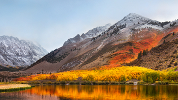
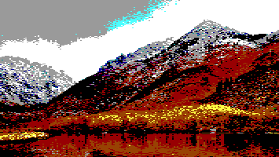
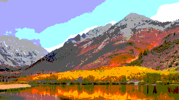

# Agifier
Convert an image to look like an 8-bit image from an AGI-era 1980s Sierra On-Line computer game.  This project consists of two parts: a command line tool (`agi_image_converter`) which is written in Objective-C, and a plug-in for the [Acorn](https://flyingmeat.com/acorn/) image editor.

**Original**  

**Modified by `agi_image_converter` script**  

**Modified by Agifier Acorn Plug-In**  

## AGI Image Converter Script

The `agi_image_converter` is a command-line utility for the Mac written in Objective-C.  It will take the given image and convert it, and then generate a new image with `_agi.png` appended to the file name taken from the original image.

To compile: `gcc -w -framework Foundation -framework AppKit -framework QuartzCore agi_image_converter.m -o agi_image_converter`

To run: `./agi_image_converter path/to/image.png`

## Acorn Plug-In

The Agifier project was built with Xcode 11 on macOS Mojave.  The `Agifier.acplugin` file can be copied to `~/Library/Application Support/Acorn/Plug-Ins` to work with Acorn.  The Agifier plug-in is available in the **Filter > Stylize > Agifier** menu.

